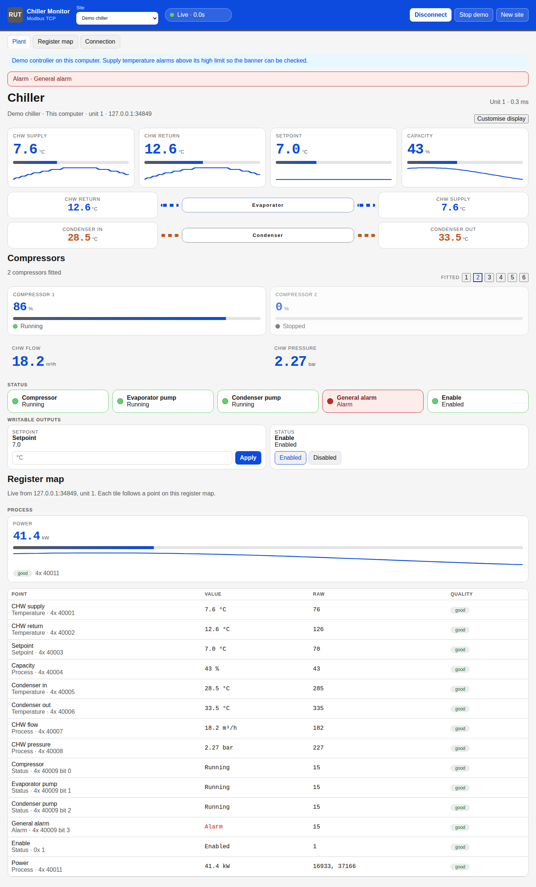
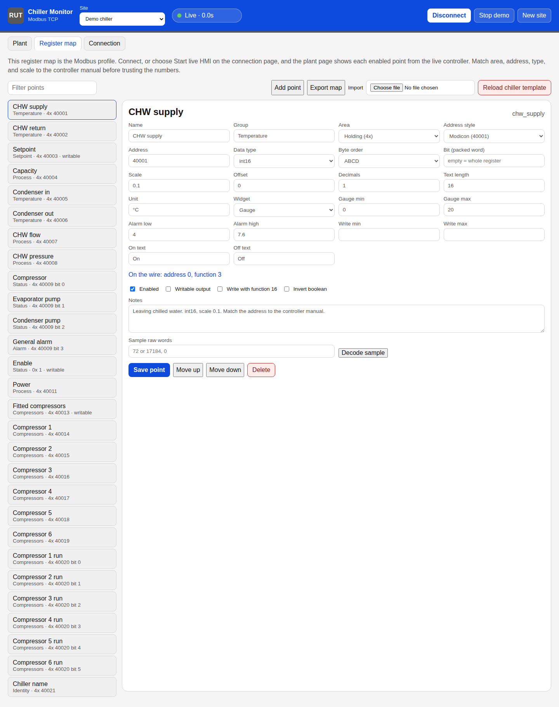
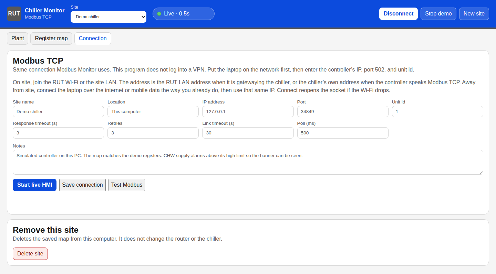

# RUT Chiller Monitor

Local plant page for a water chiller on a Teltonika RUT. The laptop joins the network first. The app then opens the same socket Modbus Monitor uses — Modbus TCP, or Modbus RTU over TCP — and shows an at-a-glance HMI in its own window. **Customise display** on the plant page chooses which sections are shown, which point fills each tile, and how each point is drawn. The register map — addresses, types, scaling, alarms, and which points can be written — is edited in the app.

## Screenshots

The demo chiller, in the Aqua Cooling colours.







## Run

```bash
python3 -m venv .venv
source .venv/bin/activate
pip install -r requirements.txt
python -m app
```

Open http://127.0.0.1:8765 and choose **Demo chiller** to see the HMI without hardware.

The server listens on this computer only. Site profiles stay in `data/` and are not committed.

## Install at home

Build both packages from this repository:

```bash
packaging/build-all.sh
```

- Windows: `dist/ChillerMonitor-0.1.0-Setup.exe`. It installs for the current user, Python included, adds Start menu and desktop shortcuts, and appears in Installed apps. The shortcuts open Chiller Monitor in its own window. Windows may warn that the publisher is unknown; choose More info, then Run anyway. The window uses the Edge WebView2 Runtime included with Windows 11 and current Windows 10. Site profiles are kept in `%LOCALAPPDATA%\ChillerMonitor`.
- Linux, 64-bit Fedora or Nobara with Python 3.14: `dist/chiller-monitor-0.1.0-5.fc44.x86_64.rpm`. Install it with `sudo dnf install ./dist/chiller-monitor-0.1.0-5.fc44.x86_64.rpm`. The application menu opens it in its own window. Site profiles are kept in `~/.local/share/chiller-monitor`.

Close the program window to stop it. Choose **Demo chiller** to try the HMI without a controller. **Customise display** changes the plant page for that site.

## Updates

A push to `main` builds a Windows installer and a Fedora/Nobara RPM, then publishes them as a GitHub release. An installed copy checks that release when it opens. **Download and install** replaces the program and reopens it. Site profiles are kept. Linux asks for your password. Install this version once on each computer; copies from before the update check cannot see later releases until they are installed again.

## Connection

1. Put the chiller on the RUT. A controller with RS485 uses a serial model (for example a RUT956). Two RutOS services match the two protocols in Modbus Monitor:
   - **Services → Modbus → Modbus TCP over Serial Gateway** translates Modbus TCP into RTU. In this app choose **Modbus TCP**.
   - **Services → Serial Utilities → Over IP**, Raw mode on, protocol TCP, forwards the serial bytes unchanged. In this app choose **RTU over TCP**, the same framing Modbus Monitor uses when Interface is TCP and Protocol is RTU.
   A controller that already speaks Modbus TCP only needs to be on the RUT LAN. Choose **Modbus TCP** and the controller’s own address.
2. On site, join the RUT Wi-Fi or the site LAN from the laptop. Away from site, bring up the remote route you already use (the laptop VPN, RMS, or mobile data path) before opening this app.
3. Create a site and set the protocol, IP address, port, and the controller unit id. Connect. The program polls that socket, pauses for the inter-frame gap between requests, and opens a new socket if the link stays quiet past the link timeout.
4. Open **Register map** and match every point to the controller manual: area, address, data type, byte order, scale, and bit. Mark setpoints and coils as writable if the engineer is allowed to change them.
5. On **Connection**, choose **Start live HMI**. The plant page reads every enabled point on the register map over Modbus TCP and draws it from the live values. Points already placed on the water diagram, compressor cards, status lamps, or writable outputs stay there. Everything else — including a profile that does not use the chilled-water tiles — appears under **Register map**, grouped as it is on the map.
6. Choose **Customise display** to show or hide the diagram, compressors, readings, status lamps, writable outputs, the register-map faceplate, and the live table. Pick the point for each diagram tile, the diagram labels, and whether a point is drawn as a value, gauge, status lamp, alarm, or hidden.

The plant heading is the chiller name read from Modbus. A blank or missing name shows as Chiller. Match the text point’s address and length to the controller.

The plant page reads the fitted-compressor register and shows that many circuits, each with its load percentage, up to six. A chiller that reports 2 shows two cards. A larger machine shows the extra compressors. Match **Fitted compressors**, each **Compressor N** load, and each run bit to the controller. The supplied controller sheets are the single-compressor demo and the two-compressor chiller. On the two-compressor sheet, temperatures and refrigerant pressures use gain 0.1, and 400034 is compressor 2 suction pressure. Sheets for chillers with more compressors can be added when they are available.

## Mapper

The Mapper tab listens to an RS-485 network, builds a register map from the traffic it hears, saves the exchanges, and can play them back to the plant page.

1. **Capture.** Choose the USB to RS-485 adapter, baud, parity, and Modbus RTU or ASCII. **Start monitor** only listens. It does not transmit requests onto the network.
2. **Map.** **Mapping** stays off until you turn it on. With it on, each register in a response becomes a row. Set the name, data type, word order, scale, and whether the address is protocol (0-based) or Modicon.
3. **Record.** **Start record**, then **Save recording**. A saved JSON file can be loaded later.
4. **Replay.** **Show on plant** serves the captured responses on this computer and opens them on the plant page, so the HMI can be tried without the field device. **Replace** stays off until you turn it on. With it off, the open site keeps its register map and only the connection points at the emulator. With it on, the captured registers replace that map. Load recording follows the same switch.

## Tests

```bash
pytest
```
